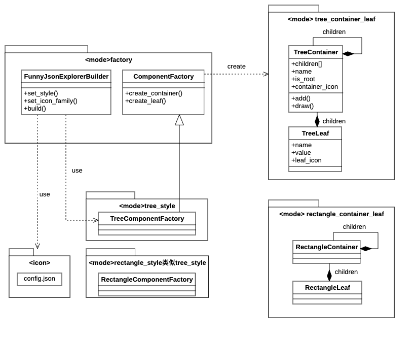

# Funny JSON Explorer 设计文档

## 引言 (Introduction)
Funny JSON Explorer (FJE) 是一个用于可视化JSON文件的命令行工具。用户可以通过简单的命令参数快速切换JSON文件的显示风格和图标风格，从而以更加直观和友好的方式查看和分析JSON数据。

## 类图 (Class Diagram)



## 类和接口 (Classes and Interfaces)

### FunnyJsonExplorerBuilder
- **方法**：
  - `set_style(style: str) `：设置显示风格。
  - `set_icon_family(icon_family: str) `：设置图标风格。
  - `build() -> FunnyJsonExplorer`：构建并返回一个完整的FunnyJsonExplorer对象。

### ComponentFactory
- **方法**：
  - `create_container(name: str, is_root: bool) -> Container`：创建一个新的容器。
  - `create_leaf(name: str, value: Any) -> Leaf`：创建一个新的叶子节点。

### TreeContainer
- **属性**：
  - `children: List[Container or Leaf]`：包含的子节点。
  - `name: str`：容器名称。
  - `is_root: bool`：是否是根节点。
- **方法**：
  - `add(child: Container or Leaf) `：添加子节点。
  - `draw()`：绘制容器及其子节点。

### config.json

这是一个配置文件，可以在其中指定图标簇的名称，以及名称对应的container图标和leaf图标，实现**通过配置文件，即可添加新的图标簇**。

以下面为例，“default”即是图标簇名称，"\uD83D\uDCE6"是container图标的unicode，\uD83D\uDCD6是leaf图标的unicode，设置好之后命令行输入图标簇名称就可以使用对应的图标簇了。


## 使用的设计模式 (Design Patterns Used)

### 工厂方法（Factory Method）
- **用途**：用于定义一个用于创建对象的接口，让子类决定实例化哪一个类。工厂方法使得一个类的实例化延迟到其子类。
- **实现**：`ComponentFactory`类通过`create_container`和`create_leaf`方法来创建容器和叶子节点。`create_container`和`create_leaf`方法是工厂化方法，这样可以在不修改现有代码的情况下，通过创建新的工厂类来生成不同类型的容器和叶子节点。

### 抽象工厂（Abstract Factory）
- **用途**：提供一个接口，用于创建一系列相关或互相依赖的对象，而无需指定它们具体的类。抽象工厂将一组对象的创建封装在一起，使得客户端与具体的创建过程解耦。
- **实现**：`TreeComponentFactory`和`RectangleComponentFactory`实现了`ComponentFactory`接口，用于创建不同风格的组件。这样，如果需要增加新的风格，只需实现新的工厂类即可。

### 建造者（Builder）
- **用途**：将一个复杂对象的构建过程与其表示分离，使得同样的构建过程可以创建不同的表示。建造者模式通过一步步创建最终对象，使得创建过程更加清晰和可控。
- **实现**：`FunnyJsonExplorerBuilder`类用于设置风格和图标，并最终构建一个`FunnyJsonExplorer`对象。通过这种方式，可以灵活地设置不同的参数，生成不同配置的对象。

### 组合模式（Composite）
- **用途**：将对象组合成树形结构以表示“部分-整体”的层次结构，使得客户端对单个对象和组合对象的使用具有一致性。组合模式使得客户端可以忽略组合对象与单个对象的差异，以统一的方式处理它们。
- **实现**：`TreeContainer`和`TreeLeaf`类通过包含子节点的列表，实现了树形结构的组合。这样，客户端可以统一处理容器和叶子节点，而不需要区分它们的类型。


## 其他（The Other）

1. 为了实现rectangle_style对于输入json大小的自适应（指的输出的矩形框的大小），在rectangle中加入了walk方法，来模拟一遍draw确定合适的输出矩形框大小。
2. 代码中为了方便理解，对于重点逻辑给出了详细具体的注释。
3. 为了防止重复代码造成的问题，在具体style中加入了渲染一行内容的函数，来减少重复代码。
4. 在项目目录下输入命令`pip install .`，即可完成程序的安装，后续直接在命令行中使用即可

```
fje -f <json file> -s <style> -i <icon family>
```

- `<json file>`：要可视化的JSON文件路径。
- `<style>`：显示风格（tree 或 rectangle）。
- `<icon family>`：图标风格。
